```python
# Let's start off by importing the relevant libraries
import pandas as pd
import numpy as np
import math
import itertools
from sklearn.cluster import KMeans
from sklearn.metrics import pairwise_distances_argmin
from datetime import datetime
import time
import matplotlib.pyplot as plt
%matplotlib inline

plt.style.use('ggplot')
plt.rcParams['figure.figsize'] = (15, 8)
```

# Loading data


```python
# Import raw data
def import_data():
    df = pd.read_csv("gimmer.csv", header=0) # creates a Pandas data frame for input value
    df.head()
    df['date'] = df['TIMESTAMP']
    df = df.drop(columns=['TIMESTAMP'])
    df.head()
    return df
```


```python
raw_data_df = import_data()
raw_data_df.head()
```


<div>
<style scoped>
    .dataframe tbody tr th:only-of-type {
        vertical-align: middle;
    }

    .dataframe tbody tr th {
        vertical-align: top;
    }

    .dataframe thead th {
        text-align: right;
    }
</style>
<table border="1" class="dataframe">
  <thead>
    <tr style="text-align: right;">
      <th></th>
      <th>status</th>
      <th>avgMeasuredTime</th>
      <th>avgSpeed</th>
      <th>extID</th>
      <th>medianMeasuredTime</th>
      <th>vehicleCount</th>
      <th>_id</th>
      <th>REPORT_ID</th>
      <th>date</th>
    </tr>
  </thead>
  <tbody>
    <tr>
      <th>0</th>
      <td>OK</td>
      <td>66</td>
      <td>56</td>
      <td>668</td>
      <td>66</td>
      <td>7</td>
      <td>190000</td>
      <td>158324</td>
      <td>2014-02-13T11:30:00</td>
    </tr>
    <tr>
      <th>1</th>
      <td>OK</td>
      <td>69</td>
      <td>53</td>
      <td>668</td>
      <td>69</td>
      <td>5</td>
      <td>190449</td>
      <td>158324</td>
      <td>2014-02-13T11:35:00</td>
    </tr>
    <tr>
      <th>2</th>
      <td>OK</td>
      <td>69</td>
      <td>53</td>
      <td>668</td>
      <td>69</td>
      <td>6</td>
      <td>190898</td>
      <td>158324</td>
      <td>2014-02-13T11:40:00</td>
    </tr>
    <tr>
      <th>3</th>
      <td>OK</td>
      <td>70</td>
      <td>52</td>
      <td>668</td>
      <td>70</td>
      <td>3</td>
      <td>191347</td>
      <td>158324</td>
      <td>2014-02-13T11:45:00</td>
    </tr>
    <tr>
      <th>4</th>
      <td>OK</td>
      <td>64</td>
      <td>57</td>
      <td>668</td>
      <td>64</td>
      <td>6</td>
      <td>191796</td>
      <td>158324</td>
      <td>2014-02-13T11:50:00</td>
    </tr>
  </tbody>
</table>
</div>


```python
#display all data replace result by desired raw_data
label = 'avgSpeed'
result=raw_data_df
result['date']=pd.to_datetime(result['date'])
data=result.loc[:, [label]]
data = data.set_index(result.date)
data['avgSpeed'] = pd.to_numeric(data['avgSpeed'],downcast='float',errors='coerce')
```


```python
data.head()
```


<div>
<style scoped>
    .dataframe tbody tr th:only-of-type {
        vertical-align: middle;
    }

    .dataframe tbody tr th {
        vertical-align: top;
    }

    .dataframe thead th {
        text-align: right;
    }
</style>
<table border="1" class="dataframe">
  <thead>
    <tr style="text-align: right;">
      <th></th>
      <th>avgSpeed</th>
    </tr>
    <tr>
      <th>date</th>
      <th></th>
    </tr>
  </thead>
  <tbody>
    <tr>
      <th>2014-02-13 11:30:00</th>
      <td>56.0</td>
    </tr>
    <tr>
      <th>2014-02-13 11:35:00</th>
      <td>53.0</td>
    </tr>
    <tr>
      <th>2014-02-13 11:40:00</th>
      <td>53.0</td>
    </tr>
    <tr>
      <th>2014-02-13 11:45:00</th>
      <td>52.0</td>
    </tr>
    <tr>
      <th>2014-02-13 11:50:00</th>
      <td>57.0</td>
    </tr>
  </tbody>
</table>
</div>


```python
data.dropna().describe()
```


<div>
<style scoped>
    .dataframe tbody tr th:only-of-type {
        vertical-align: middle;
    }

    .dataframe tbody tr th {
        vertical-align: top;
    }

    .dataframe thead th {
        text-align: right;
    }
</style>
<table border="1" class="dataframe">
  <thead>
    <tr style="text-align: right;">
      <th></th>
      <th>avgSpeed</th>
    </tr>
  </thead>
  <tbody>
    <tr>
      <th>count</th>
      <td>4.529241e+06</td>
    </tr>
    <tr>
      <th>mean</th>
      <td>4.829084e+01</td>
    </tr>
    <tr>
      <th>std</th>
      <td>2.349162e+01</td>
    </tr>
    <tr>
      <th>min</th>
      <td>0.000000e+00</td>
    </tr>
    <tr>
      <th>25%</th>
      <td>3.100000e+01</td>
    </tr>
    <tr>
      <th>50%</th>
      <td>4.400000e+01</td>
    </tr>
    <tr>
      <th>75%</th>
      <td>6.200000e+01</td>
    </tr>
    <tr>
      <th>max</th>
      <td>1.490000e+02</td>
    </tr>
  </tbody>
</table>
</div>


## Resampling


```python
label = 'avgSpeed'
daily = data.resample('D').mean()
daily.dropna(inplace=True)
daily.plot(style=[':', '--', '-'],
           title='Daily '+label)

weekly = data.resample('W').mean()
weekly.dropna(inplace=True)
weekly.plot(style=[':', '--', '-'],
            title='Weekly '+label)

hourly = data.resample('H').mean()
hourly.dropna(inplace=True)
hourly.plot(style=[':', '--', '-'],
            title='Hourly '+label)
```


    <matplotlib.axes._subplots.AxesSubplot at 0x7f15a1d94ba8>


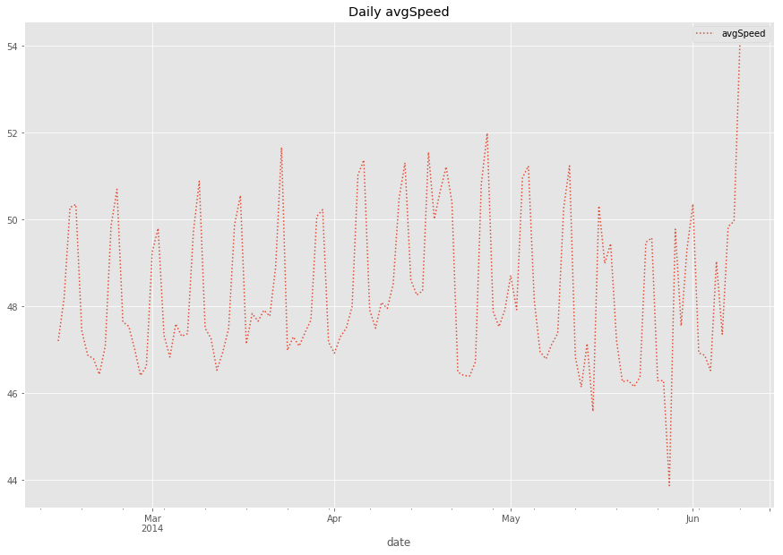


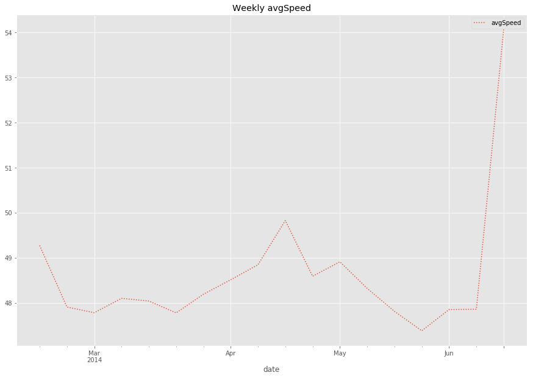


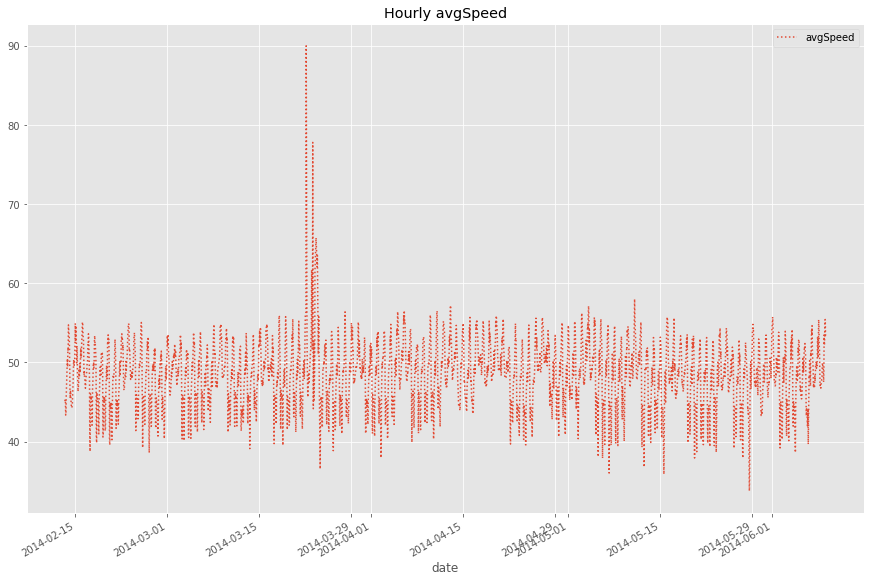


```python
plt.rcParams['figure.figsize'] = (15, 10)
ts = data.resample('D').mean()
ts['weekday'] = ts.index.weekday
fig, ax = plt.subplots()
ts.groupby('weekday').agg(lambda x: x[label].plot(ax=ax,
                                                       legend=True,
                                                       label=x.index.weekday_name[0]))
plt.title("Avg weekday speed with Daily aggregate ")
plt.show()

ts = daily.rolling(30, center=True).mean()
ts['weekday'] = ts.index.weekday
fig, ax = plt.subplots()
ts.groupby('weekday').agg(lambda x: x[label].plot(ax=ax,
                                                       legend=True,
                                                       label=x.index.weekday_name[0]))
plt.title("Avg weekday speed with Weekly aggregate ")
plt.show()
```


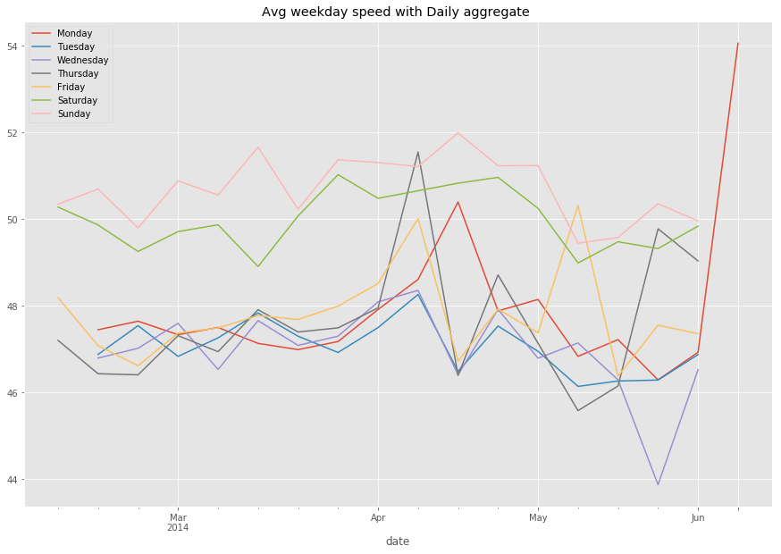


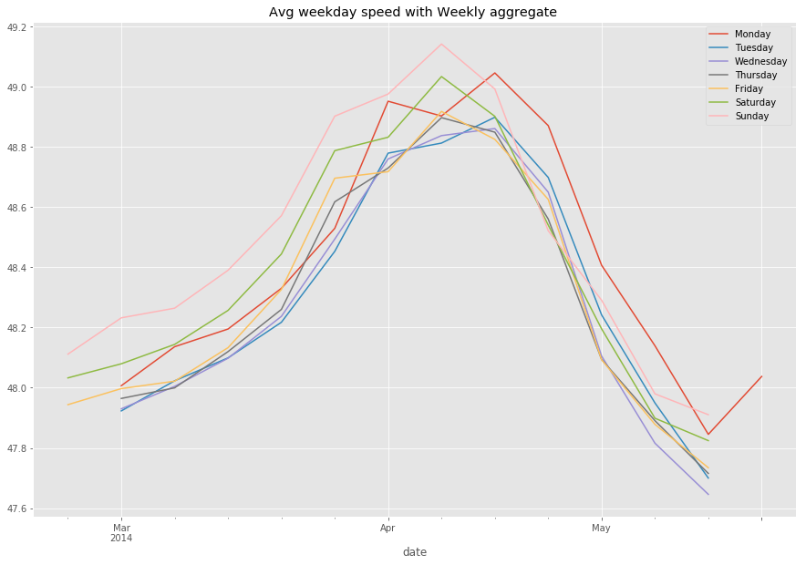


```python
daily = data.resample('D').mean()
daily.rolling(30, center=True).mean().plot(style=[':', '--', '-'],
                                           title='Monthly rolling '+label)

```


    <matplotlib.axes._subplots.AxesSubplot at 0x7f15aba41710>


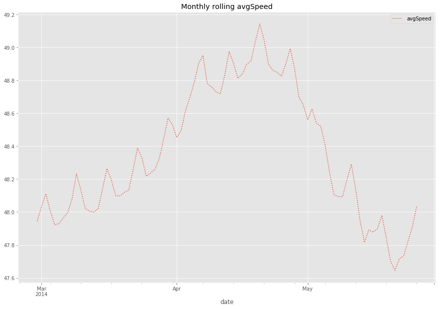


```python
by_time = data.groupby(data.index.time).mean()
hourly_ticks = 4 * 60 * 60 * np.arange(6)
by_time.plot(xticks=hourly_ticks, style=[':', '--', '-'],
            title="Hourly "+label);
```


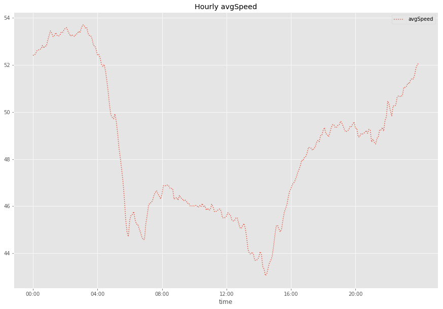


```python
data.rolling(360).mean().plot(figsize=(20,10), linewidth=5, fontsize=20)
plt.xlabel('Year', fontsize=20);
```


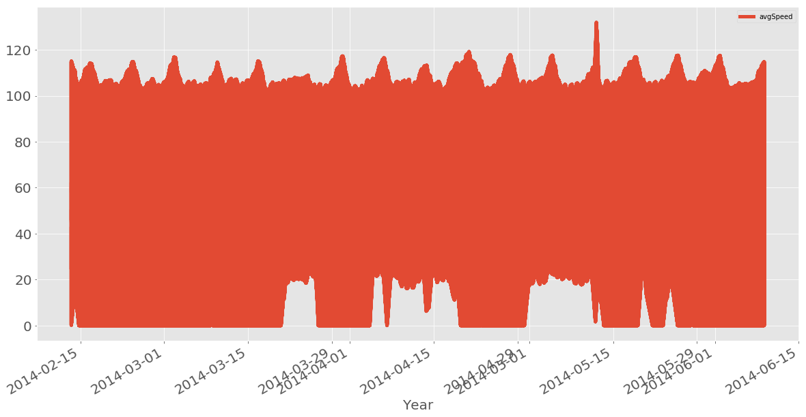


## Additional explorations


```python
df = raw_data_df.loc[:,['date', label]]
df[label]=pd.to_numeric(df[label],errors='coerce')
df = df.groupby(['date']).mean().reset_index()
df.head()
```


<div>
<style scoped>
    .dataframe tbody tr th:only-of-type {
        vertical-align: middle;
    }

    .dataframe tbody tr th {
        vertical-align: top;
    }

    .dataframe thead th {
        text-align: right;
    }
</style>
<table border="1" class="dataframe">
  <thead>
    <tr style="text-align: right;">
      <th></th>
      <th>date</th>
      <th>avgSpeed</th>
    </tr>
  </thead>
  <tbody>
    <tr>
      <th>0</th>
      <td>2014-02-13 11:30:00</td>
      <td>45.813333</td>
    </tr>
    <tr>
      <th>1</th>
      <td>2014-02-13 11:35:00</td>
      <td>45.273333</td>
    </tr>
    <tr>
      <th>2</th>
      <td>2014-02-13 11:40:00</td>
      <td>44.106667</td>
    </tr>
    <tr>
      <th>3</th>
      <td>2014-02-13 11:45:00</td>
      <td>44.640000</td>
    </tr>
    <tr>
      <th>4</th>
      <td>2014-02-13 11:50:00</td>
      <td>45.726667</td>
    </tr>
  </tbody>
</table>
</div>


```python
df.plot.line(x = 'date', y = label,  figsize=(18,9), linewidth=5, fontsize=20)
plt.title("Continuous Average speed (small peaks are night time, bigger peaks are weekends)")
plt.show()
```


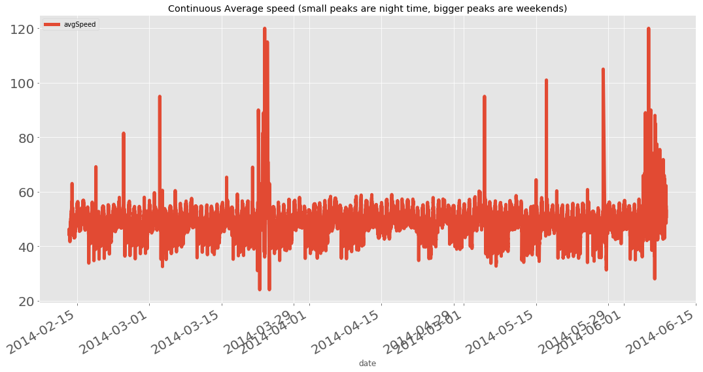


```python
mon = df['date']
temp= pd.DatetimeIndex(mon)
month = pd.Series(temp.month)
to_be_plotted  = df.drop(['date'], axis = 1)
to_be_plotted = to_be_plotted.join(month)
to_be_plotted.plot.scatter(x = label, y = 'date', figsize=(16,8), linewidth=5, fontsize=20)
plt.title('Scatter pllot for '+label)
plt.show()
```


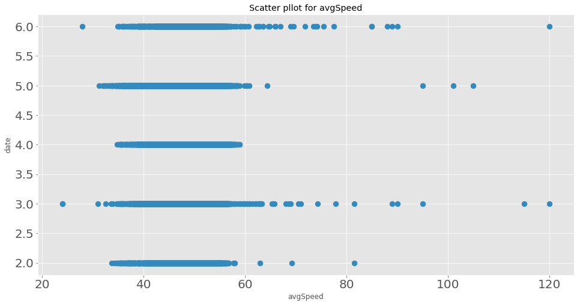


```python
plt.title("Trend analysis for "+label)
df[label].rolling(5).mean().plot(figsize=(20,10), linewidth=5, fontsize=20)
plt.show()
```


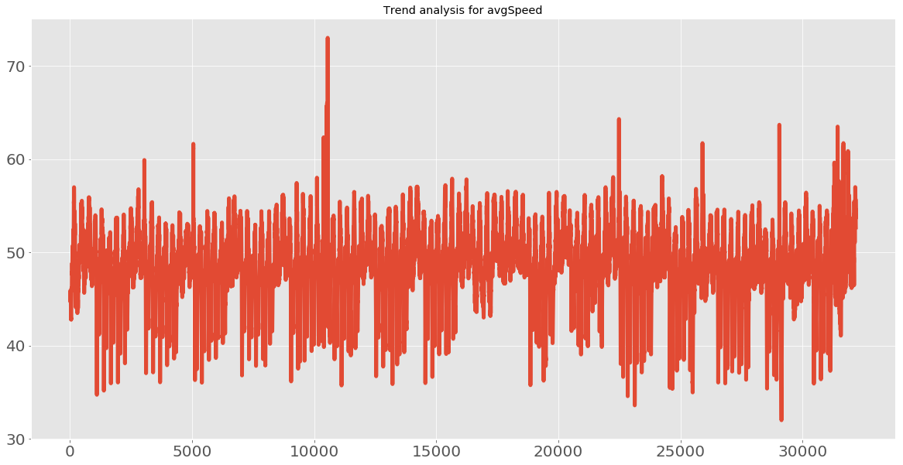


```python
plt.title("Seasonal analysis for "+label)
df[label].diff(periods=30).plot(figsize=(20,10), linewidth=5, fontsize=20)
plt.show()
```


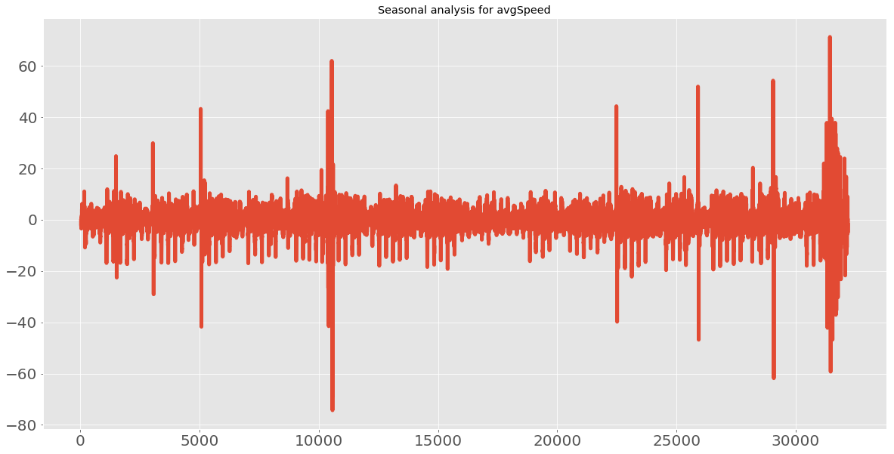


```python
plt.title("Autocorrelation Plot: "+label)
pd.plotting.autocorrelation_plot(df[label])
plt.show()
```

    /home/enigmaeth/miniconda3/envs/tf/lib/python3.6/site-packages/matplotlib/pyplot.py:934: UserWarning: Requested projection is different from current axis projection, creating new axis with requested projection.
      return gcf().gca(**kwargs)


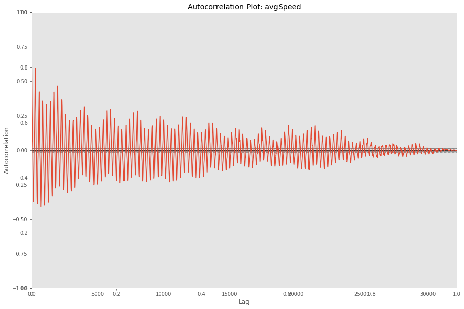


```python
plt.title("Lag Plot: "+label)
pd.plotting.lag_plot(df[label])
plt.show()
```


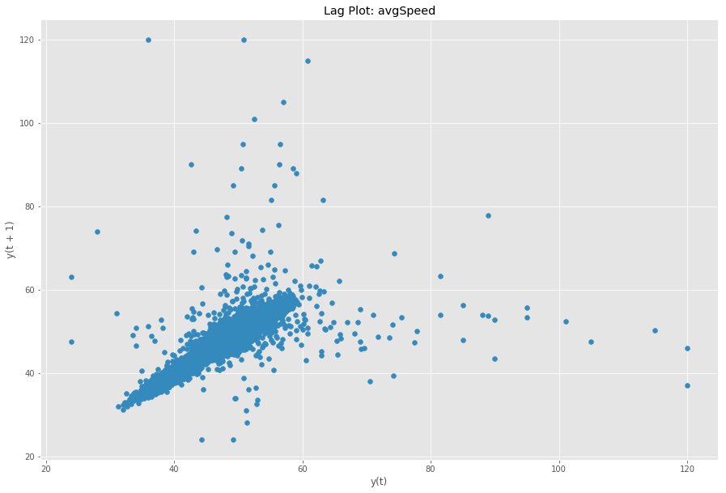


# LSTM prediction


```python
data_ = hourly
mydata=data_.loc[:, [label]]
mydata = mydata.set_index(data_.index)
mydata.head()
mydata.shape
```


    (2745, 1)


```python
#Use MinMaxScaler to normalize 'KWH/hh (per half hour) ' to range from 0 to 1
from sklearn.preprocessing import MinMaxScaler
values = mydata[label].values.reshape(-1,1)
values = values.astype('float32')
scaler = MinMaxScaler(feature_range=(0, 1))
scaled = scaler.fit_transform(values)
```


```python
train_size = int(len(scaled) * 0.8)
test_size = len(scaled) - train_size
train, test = scaled[0:train_size,:], scaled[train_size:len(scaled),:]
print(len(train), len(test))
```

    2196 549


```python
def create_dataset(dataset, look_back=1):
    dataX, dataY = [], []
    for i in range(len(dataset) - look_back):
        a = dataset[i:(i + look_back), 0]
        dataX.append(a)
        dataY.append(dataset[i + look_back, 0])
    print(len(dataY))
    return np.array(dataX), np.array(dataY)
```


```python
look_back = 5
trainX, trainY = create_dataset(train, look_back)
testX, testY = create_dataset(test, look_back)
```

    2191
    544


```python
trainX = np.reshape(trainX, (trainX.shape[0], 1, trainX.shape[1]))
testX = np.reshape(testX, (testX.shape[0], 1, testX.shape[1]))
```


```python
from keras.models import Sequential
from keras.layers import Dense
from keras.layers import LSTM
model = Sequential()
model.add(LSTM(100, input_shape=(trainX.shape[1], trainX.shape[2])))
model.add(Dense(1))
model.compile(loss='mae', optimizer='adam')
history = model.fit(trainX, trainY, epochs=30, batch_size=10, validation_data=(testX, testY), verbose=1, shuffle=False)
```

    Train on 2191 samples, validate on 544 samples
    Epoch 1/30
    2191/2191 [==============================] - 3s 1ms/step - loss: 0.0543 - val_loss: 0.0356
    Epoch 2/30
    2191/2191 [==============================] - 2s 781us/step - loss: 0.0336 - val_loss: 0.0309
    Epoch 3/30
    2191/2191 [==============================] - 2s 779us/step - loss: 0.0313 - val_loss: 0.0287
    Epoch 4/30
    2191/2191 [==============================] - 2s 788us/step - loss: 0.0301 - val_loss: 0.0271
    Epoch 5/30
    2191/2191 [==============================] - 2s 794us/step - loss: 0.0290 - val_loss: 0.0262
    Epoch 6/30
    2191/2191 [==============================] - 2s 786us/step - loss: 0.0287 - val_loss: 0.0254
    Epoch 7/30
    2191/2191 [==============================] - 2s 788us/step - loss: 0.0281 - val_loss: 0.0254
    Epoch 8/30
    2191/2191 [==============================] - 2s 785us/step - loss: 0.0275 - val_loss: 0.0249
    Epoch 9/30
    2191/2191 [==============================] - 2s 792us/step - loss: 0.0271 - val_loss: 0.0241
    Epoch 10/30
    2191/2191 [==============================] - 2s 921us/step - loss: 0.0269 - val_loss: 0.0243
    Epoch 11/30
    2191/2191 [==============================] - 2s 938us/step - loss: 0.0269 - val_loss: 0.0241
    Epoch 12/30
    2191/2191 [==============================] - 2s 1ms/step - loss: 0.0267 - val_loss: 0.0239
    Epoch 13/30
    2191/2191 [==============================] - 2s 1ms/step - loss: 0.0266 - val_loss: 0.0240
    Epoch 14/30
    2191/2191 [==============================] - 2s 949us/step - loss: 0.0265 - val_loss: 0.0239
    Epoch 15/30
    2191/2191 [==============================] - 2s 972us/step - loss: 0.0264 - val_loss: 0.0238
    Epoch 16/30
    2191/2191 [==============================] - 2s 1ms/step - loss: 0.0263 - val_loss: 0.0238
    Epoch 17/30
    2191/2191 [==============================] - 2s 969us/step - loss: 0.0261 - val_loss: 0.0237
    Epoch 18/30
    2191/2191 [==============================] - 2s 995us/step - loss: 0.0263 - val_loss: 0.0237
    Epoch 19/30
    2191/2191 [==============================] - 2s 937us/step - loss: 0.0263 - val_loss: 0.0239
    Epoch 20/30
    2191/2191 [==============================] - 2s 952us/step - loss: 0.0261 - val_loss: 0.0236
    Epoch 21/30
    2191/2191 [==============================] - 2s 1ms/step - loss: 0.0261 - val_loss: 0.0237
    Epoch 22/30
    2191/2191 [==============================] - 2s 980us/step - loss: 0.0262 - val_loss: 0.0237
    Epoch 23/30
    2191/2191 [==============================] - 2s 969us/step - loss: 0.0261 - val_loss: 0.0237
    Epoch 24/30
    2191/2191 [==============================] - 2s 978us/step - loss: 0.0261 - val_loss: 0.0236
    Epoch 25/30
    2191/2191 [==============================] - 3s 1ms/step - loss: 0.0260 - val_loss: 0.0236
    Epoch 26/30
    2191/2191 [==============================] - 3s 1ms/step - loss: 0.0259 - val_loss: 0.0237
    Epoch 27/30
    2191/2191 [==============================] - 2s 994us/step - loss: 0.0259 - val_loss: 0.0238
    Epoch 28/30
    2191/2191 [==============================] - 2s 971us/step - loss: 0.0259 - val_loss: 0.0236
    Epoch 29/30
    2191/2191 [==============================] - 2s 1ms/step - loss: 0.0259 - val_loss: 0.0237
    Epoch 30/30
    2191/2191 [==============================] - 2s 1ms/step - loss: 0.0260 - val_loss: 0.0236


```python
plt.plot(history.history['loss'], label='train')
plt.plot(history.history['val_loss'], label='test')
plt.legend()
```


    <matplotlib.legend.Legend at 0x7f15047fcf60>


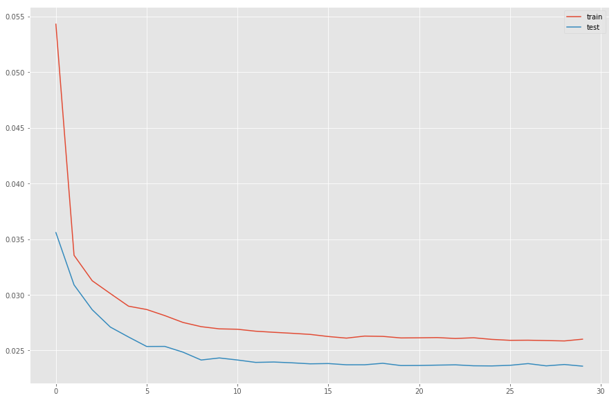


```python
yhat = model.predict(testX)
plt.plot(yhat, label='predict')
plt.plot(testY, label='true')
plt.legend()
```


    <matplotlib.legend.Legend at 0x7f15047501d0>


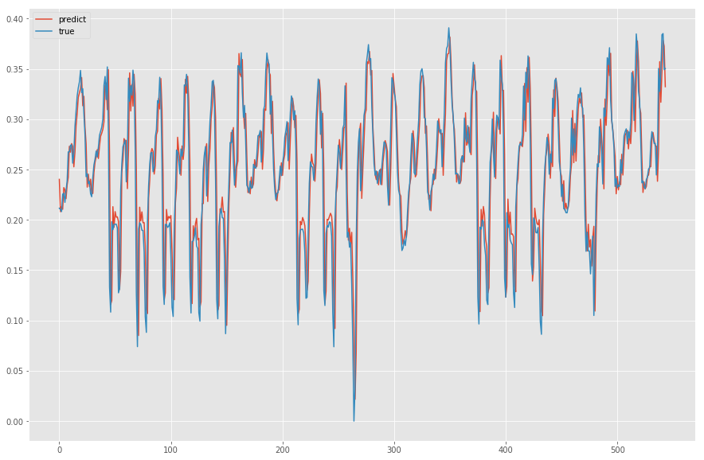


```python
from math import sqrt
from sklearn.metrics import mean_squared_error
yhat_inverse = scaler.inverse_transform(yhat.reshape(-1, 1))
testY_inverse = scaler.inverse_transform(testY.reshape(-1, 1))
rmse = sqrt(mean_squared_error(testY_inverse, yhat_inverse))
print('Test RMSE: %.3f' % rmse)
```

    Test RMSE: 1.901


```python
plt.plot(yhat_inverse, label='predict')
plt.plot(testY_inverse, label='actual', alpha=0.5)
plt.legend()
```


    <matplotlib.legend.Legend at 0x7f15046d1400>


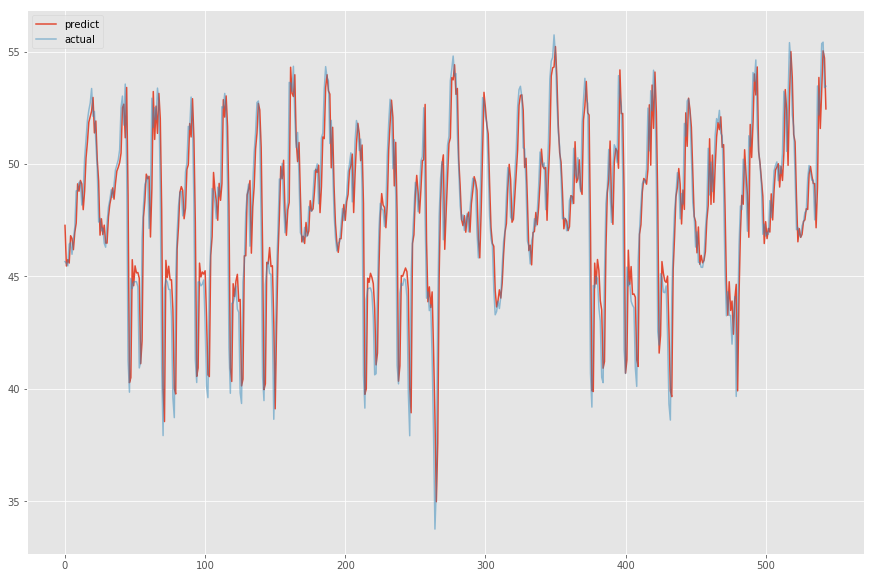


# Clustering


```python
raw_data_df['date']=pd.to_datetime(raw_data_df['date'])
raw_data_df['dy']=raw_data_df['date'].dt.dayofyear
raw_data_df['heure']=raw_data_df['date'].dt.time
data_2014=raw_data_df.loc[:, ['heure','dy',label]]
temp=raw_data_df.loc[:, ['dy',label]]
data_2014[label]=pd.to_numeric(data_2014[label],errors='coerce')
temp=temp.set_index(data_2014.heure)
temp=data_2014.pivot_table(index=['heure'],columns=['dy'] ,values=[label],fill_value=0)

temp.head()
```


<div>
<style scoped>
    .dataframe tbody tr th:only-of-type {
        vertical-align: middle;
    }

    .dataframe tbody tr th {
        vertical-align: top;
    }

    .dataframe thead tr th {
        text-align: left;
    }

    .dataframe thead tr:last-of-type th {
        text-align: right;
    }
</style>
<table border="1" class="dataframe">
  <thead>
    <tr>
      <th></th>
      <th colspan="21" halign="left">avgSpeed</th>
    </tr>
    <tr>
      <th>dy</th>
      <th>44</th>
      <th>45</th>
      <th>46</th>
      <th>47</th>
      <th>48</th>
      <th>49</th>
      <th>50</th>
      <th>51</th>
      <th>52</th>
      <th>53</th>
      <th>...</th>
      <th>151</th>
      <th>152</th>
      <th>153</th>
      <th>154</th>
      <th>155</th>
      <th>156</th>
      <th>157</th>
      <th>158</th>
      <th>159</th>
      <th>160</th>
    </tr>
    <tr>
      <th>heure</th>
      <th></th>
      <th></th>
      <th></th>
      <th></th>
      <th></th>
      <th></th>
      <th></th>
      <th></th>
      <th></th>
      <th></th>
      <th></th>
      <th></th>
      <th></th>
      <th></th>
      <th></th>
      <th></th>
      <th></th>
      <th></th>
      <th></th>
      <th></th>
      <th></th>
    </tr>
  </thead>
  <tbody>
    <tr>
      <th>00:00:00</th>
      <td>0.0</td>
      <td>52.869565</td>
      <td>51.067416</td>
      <td>51.080000</td>
      <td>53.166667</td>
      <td>52.680000</td>
      <td>51.315789</td>
      <td>52.233333</td>
      <td>50.663934</td>
      <td>50.730159</td>
      <td>...</td>
      <td>49.533333</td>
      <td>53.020000</td>
      <td>52.340000</td>
      <td>49.580000</td>
      <td>53.673333</td>
      <td>49.846667</td>
      <td>50.780000</td>
      <td>28.0</td>
      <td>53.666667</td>
      <td>51.512821</td>
    </tr>
    <tr>
      <th>00:05:00</th>
      <td>0.0</td>
      <td>53.021739</td>
      <td>51.619565</td>
      <td>51.773333</td>
      <td>53.700000</td>
      <td>52.660000</td>
      <td>52.171717</td>
      <td>52.337079</td>
      <td>49.697917</td>
      <td>49.851351</td>
      <td>...</td>
      <td>49.933333</td>
      <td>53.140000</td>
      <td>53.766667</td>
      <td>49.980000</td>
      <td>53.589041</td>
      <td>60.142857</td>
      <td>52.346667</td>
      <td>0.0</td>
      <td>0.000000</td>
      <td>53.093960</td>
    </tr>
    <tr>
      <th>00:10:00</th>
      <td>0.0</td>
      <td>53.494624</td>
      <td>51.445946</td>
      <td>0.000000</td>
      <td>53.126667</td>
      <td>53.480000</td>
      <td>50.921348</td>
      <td>52.648936</td>
      <td>49.628866</td>
      <td>48.786517</td>
      <td>...</td>
      <td>49.013333</td>
      <td>53.193333</td>
      <td>53.460000</td>
      <td>49.573333</td>
      <td>53.926667</td>
      <td>0.000000</td>
      <td>0.000000</td>
      <td>0.0</td>
      <td>54.493333</td>
      <td>52.613333</td>
    </tr>
    <tr>
      <th>00:15:00</th>
      <td>0.0</td>
      <td>53.325843</td>
      <td>52.705882</td>
      <td>51.826667</td>
      <td>52.420000</td>
      <td>53.793333</td>
      <td>51.691358</td>
      <td>50.326087</td>
      <td>51.227273</td>
      <td>50.108108</td>
      <td>...</td>
      <td>48.340000</td>
      <td>52.306667</td>
      <td>52.793333</td>
      <td>49.173333</td>
      <td>53.280000</td>
      <td>51.746667</td>
      <td>0.000000</td>
      <td>74.0</td>
      <td>53.533333</td>
      <td>52.740000</td>
    </tr>
    <tr>
      <th>00:20:00</th>
      <td>0.0</td>
      <td>55.530120</td>
      <td>52.790909</td>
      <td>50.860000</td>
      <td>51.966667</td>
      <td>53.960000</td>
      <td>51.541667</td>
      <td>52.966102</td>
      <td>48.923077</td>
      <td>50.450704</td>
      <td>...</td>
      <td>48.400000</td>
      <td>53.566667</td>
      <td>52.300000</td>
      <td>50.466667</td>
      <td>52.986667</td>
      <td>51.806667</td>
      <td>0.000000</td>
      <td>0.0</td>
      <td>53.780000</td>
      <td>51.153846</td>
    </tr>
  </tbody>
</table>
<p>5 rows × 117 columns</p>
</div>


```python
temp.plot(figsize=(15, 35))
```


    <matplotlib.axes._subplots.AxesSubplot at 0x7f15a1cc1c50>


```python
temp.iloc[:,0].plot(x=temp.index.get_level_values)
temp.iloc[:,1].plot(x=temp.index.get_level_values)
temp.iloc[:,2].plot(x=temp.index.get_level_values)
```


    <matplotlib.axes._subplots.AxesSubplot at 0x7f15048610f0>


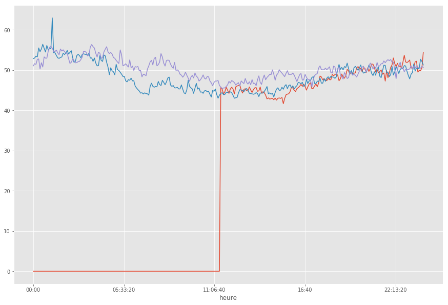


```python
plt.figure(figsize=(11,10))
colors = ['#D62728','#2C9F2C','#FD7F23','#1F77B4','#9467BD',
          '#8C564A','#7F7F7F','#1FBECF','#E377C2','#BCBD27',
          '#CD5C5C',"#FFB500"]

for i, r in enumerate([0,1,2,3,4,5,6,7,8,9,10],1):
     
    plt.subplot(4,4,i)
    plt.plot(temp.iloc[:,r],  color=colors[i], linewidth=2)
    plt.xlabel('Heurestics')
    plt.legend(loc='upper right')
    plt.tight_layout()
```


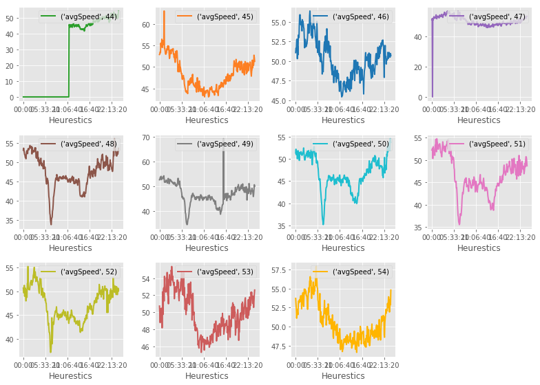


```python
from scipy.cluster.hierarchy import dendrogram, linkage
Z = linkage(temp.iloc[:,0:365], 'ward')
```


```python
plt.figure(figsize=(25, 10))
plt.title('Hierarchical Clustering Dendrogram')
plt.xlabel('sample index')
plt.ylabel('distance')
dendrogram(
    Z,
    leaf_rotation=90.,  # rotates the x axis labels
    leaf_font_size=8.,  # font size for the x axis labels
)
plt.show()
```


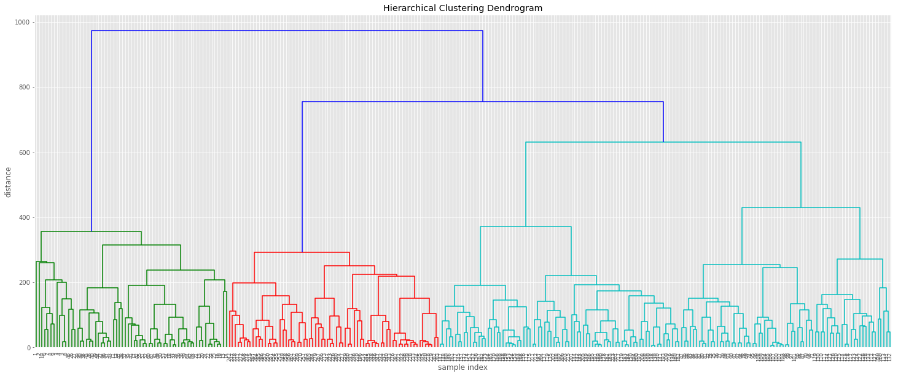


```python
plt.title('Hierarchical Clustering Dendrogram (truncated)')
plt.xlabel('sample index')
plt.ylabel('distance')
dendrogram(
    Z,
    truncate_mode='lastp',  # show only the last p merged clusters
    p=12,  # show only the last p merged clusters
    show_leaf_counts=False,  # otherwise numbers in brackets are counts
    leaf_rotation=90.,
    leaf_font_size=12.,
    show_contracted=True,  # to get a distribution impression in truncated branches
)
plt.show()
```


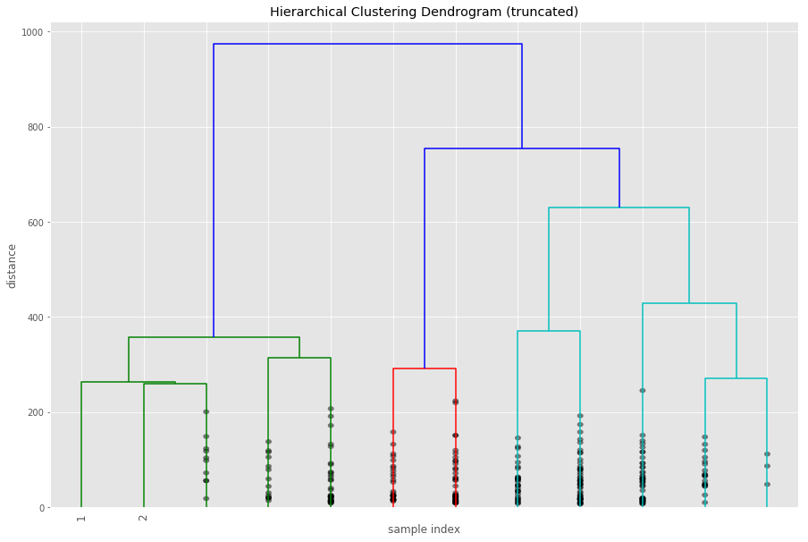

