```python
# Let's start off by importing the relevant libraries
import pandas as pd
import numpy as np
import math
import itertools
from sklearn.cluster import KMeans
from sklearn.metrics import pairwise_distances_argmin
from datetime import datetime
import time
import matplotlib.pyplot as plt
%matplotlib inline

plt.style.use('ggplot')
plt.rcParams['figure.figsize'] = (15, 8)
```

# Loading data


```python
# Import raw data
def import_data():
    df = pd.read_csv("gimmer.csv", header=0) # creates a Pandas data frame for input value
    df.head()
    df['date'] = df['TIMESTAMP']
    df = df.drop(columns=['TIMESTAMP'])
    df.head()
    return df
```


```python
raw_data_df = import_data()
raw_data_df.head()
```


<div>
<style scoped>
    .dataframe tbody tr th:only-of-type {
        vertical-align: middle;
    }

    .dataframe tbody tr th {
        vertical-align: top;
    }

    .dataframe thead th {
        text-align: right;
    }
</style>
<table border="1" class="dataframe">
  <thead>
    <tr style="text-align: right;">
      <th></th>
      <th>status</th>
      <th>avgMeasuredTime</th>
      <th>avgSpeed</th>
      <th>extID</th>
      <th>medianMeasuredTime</th>
      <th>vehicleCount</th>
      <th>_id</th>
      <th>REPORT_ID</th>
      <th>date</th>
    </tr>
  </thead>
  <tbody>
    <tr>
      <th>0</th>
      <td>OK</td>
      <td>66</td>
      <td>56</td>
      <td>668</td>
      <td>66</td>
      <td>7</td>
      <td>190000</td>
      <td>158324</td>
      <td>2014-02-13T11:30:00</td>
    </tr>
    <tr>
      <th>1</th>
      <td>OK</td>
      <td>69</td>
      <td>53</td>
      <td>668</td>
      <td>69</td>
      <td>5</td>
      <td>190449</td>
      <td>158324</td>
      <td>2014-02-13T11:35:00</td>
    </tr>
    <tr>
      <th>2</th>
      <td>OK</td>
      <td>69</td>
      <td>53</td>
      <td>668</td>
      <td>69</td>
      <td>6</td>
      <td>190898</td>
      <td>158324</td>
      <td>2014-02-13T11:40:00</td>
    </tr>
    <tr>
      <th>3</th>
      <td>OK</td>
      <td>70</td>
      <td>52</td>
      <td>668</td>
      <td>70</td>
      <td>3</td>
      <td>191347</td>
      <td>158324</td>
      <td>2014-02-13T11:45:00</td>
    </tr>
    <tr>
      <th>4</th>
      <td>OK</td>
      <td>64</td>
      <td>57</td>
      <td>668</td>
      <td>64</td>
      <td>6</td>
      <td>191796</td>
      <td>158324</td>
      <td>2014-02-13T11:50:00</td>
    </tr>
  </tbody>
</table>
</div>


```python
label = 'vehicleCount'
result=raw_data_df
result['date']=pd.to_datetime(result['date'])
data=result.loc[:, [label]]
data = data.set_index(result.date)
data[label] = pd.to_numeric(data[label],downcast='float',errors='coerce')
```


```python
data.head()
```


<div>
<style scoped>
    .dataframe tbody tr th:only-of-type {
        vertical-align: middle;
    }

    .dataframe tbody tr th {
        vertical-align: top;
    }

    .dataframe thead th {
        text-align: right;
    }
</style>
<table border="1" class="dataframe">
  <thead>
    <tr style="text-align: right;">
      <th></th>
      <th>vehicleCount</th>
    </tr>
    <tr>
      <th>date</th>
      <th></th>
    </tr>
  </thead>
  <tbody>
    <tr>
      <th>2014-02-13 11:30:00</th>
      <td>7.0</td>
    </tr>
    <tr>
      <th>2014-02-13 11:35:00</th>
      <td>5.0</td>
    </tr>
    <tr>
      <th>2014-02-13 11:40:00</th>
      <td>6.0</td>
    </tr>
    <tr>
      <th>2014-02-13 11:45:00</th>
      <td>3.0</td>
    </tr>
    <tr>
      <th>2014-02-13 11:50:00</th>
      <td>6.0</td>
    </tr>
  </tbody>
</table>
</div>


```python
data.dropna().describe()
```


<div>
<style scoped>
    .dataframe tbody tr th:only-of-type {
        vertical-align: middle;
    }

    .dataframe tbody tr th {
        vertical-align: top;
    }

    .dataframe thead th {
        text-align: right;
    }
</style>
<table border="1" class="dataframe">
  <thead>
    <tr style="text-align: right;">
      <th></th>
      <th>vehicleCount</th>
    </tr>
  </thead>
  <tbody>
    <tr>
      <th>count</th>
      <td>4.529241e+06</td>
    </tr>
    <tr>
      <th>mean</th>
      <td>5.292092e+00</td>
    </tr>
    <tr>
      <th>std</th>
      <td>7.721745e+00</td>
    </tr>
    <tr>
      <th>min</th>
      <td>0.000000e+00</td>
    </tr>
    <tr>
      <th>25%</th>
      <td>0.000000e+00</td>
    </tr>
    <tr>
      <th>50%</th>
      <td>2.000000e+00</td>
    </tr>
    <tr>
      <th>75%</th>
      <td>7.000000e+00</td>
    </tr>
    <tr>
      <th>max</th>
      <td>1.210000e+02</td>
    </tr>
  </tbody>
</table>
</div>


## Resampling


```python
label = 'vehicleCount'
daily = data.resample('D').mean()
daily.dropna(inplace=True)
daily.plot(style=[':', '--', '-'],
           title='Daily '+label)

weekly = data.resample('W').mean()
weekly.dropna(inplace=True)
weekly.plot(style=[':', '--', '-'],
            title='Weekly '+label)

hourly = data.resample('H').mean()
hourly.dropna(inplace=True)
hourly.plot(style=[':', '--', '-'],
            title='Hourly '+label)
```


    <matplotlib.axes._subplots.AxesSubplot at 0x7f1977efd748>


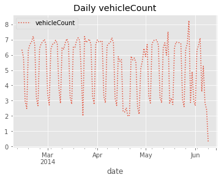


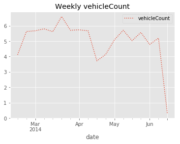


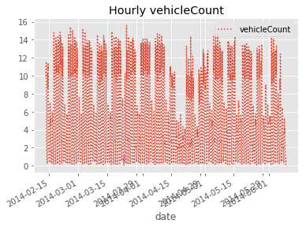


```python
plt.rcParams['figure.figsize'] = (15, 10)
ts = data.resample('D').mean()
ts['weekday'] = ts.index.weekday
fig, ax = plt.subplots()
ts.groupby('weekday').agg(lambda x: x[label].plot(ax=ax,
                                                       legend=True,
                                                       label=x.index.weekday_name[0]))
plt.title("Avg weekday speed with Daily aggregate ")
plt.show()

ts = daily.rolling(30, center=True).mean()
ts['weekday'] = ts.index.weekday
fig, ax = plt.subplots()
ts.groupby('weekday').agg(lambda x: x[label].plot(ax=ax,
                                                       legend=True,
                                                       label=x.index.weekday_name[0]))
plt.title("Avg weekday speed with Weekly aggregate ")
plt.show()
```


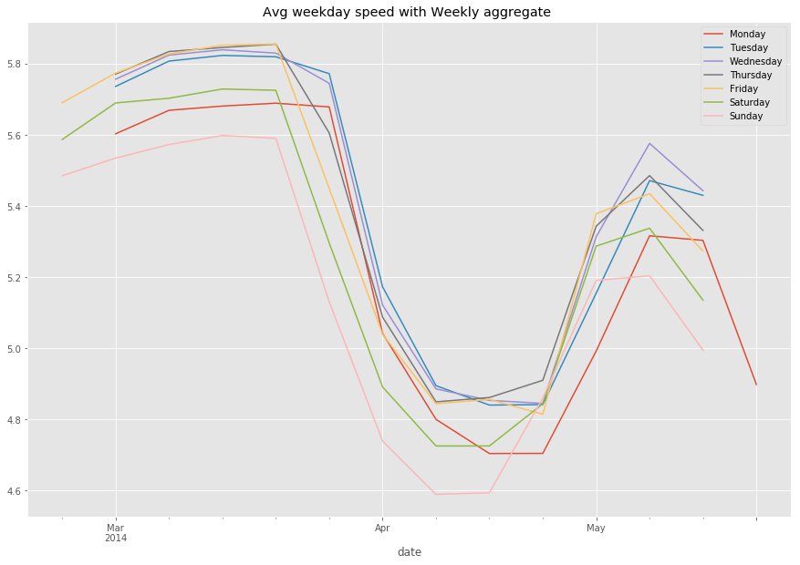


```python
daily = data.resample('D').mean()
daily.rolling(30, center=True).mean().plot(style=[':', '--', '-'],
                                           title='Monthly rolling '+label)

```


    <matplotlib.axes._subplots.AxesSubplot at 0x7f1975c79048>


```python
by_time = data.groupby(data.index.time).mean()
hourly_ticks = 4 * 60 * 60 * np.arange(6)
by_time.plot(xticks=hourly_ticks, style=[':', '--', '-'],
            title="Hourly "+label);
```


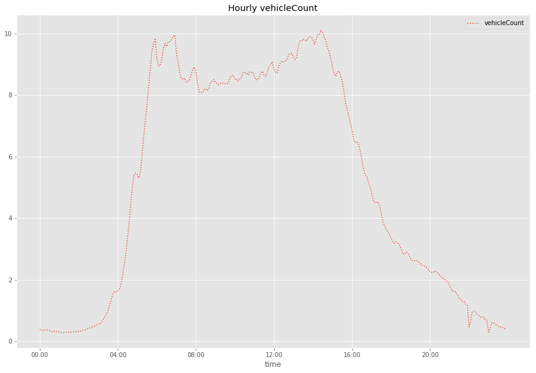


```python
data.rolling(360).mean().plot(figsize=(20,10), linewidth=5, fontsize=20)
plt.xlabel('Year', fontsize=20);
```


## Additional explorations


```python
df = raw_data_df.loc[:,['date', label]]
df[label]=pd.to_numeric(df[label],errors='coerce')
df = df.groupby(['date']).mean().reset_index()
df.head()
```


<div>
<style scoped>
    .dataframe tbody tr th:only-of-type {
        vertical-align: middle;
    }

    .dataframe tbody tr th {
        vertical-align: top;
    }

    .dataframe thead th {
        text-align: right;
    }
</style>
<table border="1" class="dataframe">
  <thead>
    <tr style="text-align: right;">
      <th></th>
      <th>date</th>
      <th>vehicleCount</th>
    </tr>
  </thead>
  <tbody>
    <tr>
      <th>0</th>
      <td>2014-02-13 11:30:00</td>
      <td>10.280000</td>
    </tr>
    <tr>
      <th>1</th>
      <td>2014-02-13 11:35:00</td>
      <td>10.060000</td>
    </tr>
    <tr>
      <th>2</th>
      <td>2014-02-13 11:40:00</td>
      <td>10.473333</td>
    </tr>
    <tr>
      <th>3</th>
      <td>2014-02-13 11:45:00</td>
      <td>10.040000</td>
    </tr>
    <tr>
      <th>4</th>
      <td>2014-02-13 11:50:00</td>
      <td>9.166667</td>
    </tr>
  </tbody>
</table>
</div>


```python
df.plot.line(x = 'date', y = label,  figsize=(18,9), linewidth=5, fontsize=20)
plt.title("Continuous Average speed (small peaks are night time, bigger peaks are weekends)")
plt.show()
```


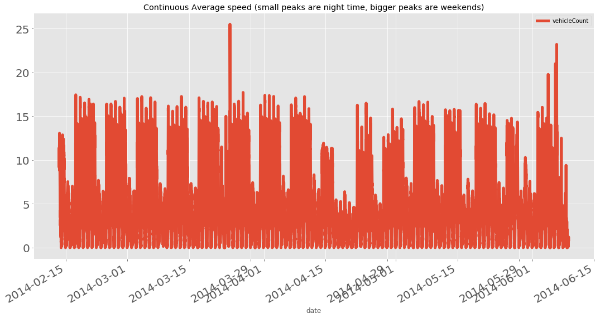


```python
mon = df['date']
temp= pd.DatetimeIndex(mon)
month = pd.Series(temp.month)
to_be_plotted  = df.drop(['date'], axis = 1)
to_be_plotted = to_be_plotted.join(month)
to_be_plotted.plot.scatter(x = label, y = 'date', figsize=(16,8), linewidth=5, fontsize=20)
plt.title('Scatter pllot for '+label)
plt.show()
```


```python
plt.title("Trend analysis for "+label)
df[label].rolling(5).mean().plot(figsize=(20,10), linewidth=5, fontsize=20)
plt.show()
```


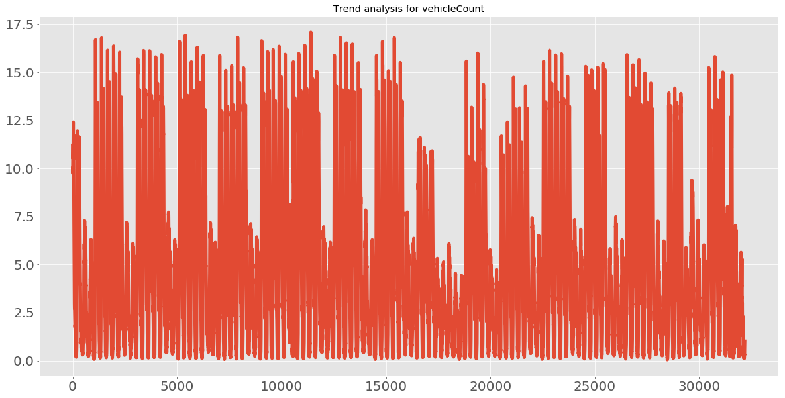


```python
plt.title("Seasonal analysis for "+label)
df[label].diff(periods=30).plot(figsize=(20,10), linewidth=5, fontsize=20)
plt.show()
```


```python
plt.title("Autocorrelation Plot: "+label)
pd.plotting.autocorrelation_plot(df[label])
plt.show()
```

    /home/enigmaeth/miniconda3/envs/tf/lib/python3.6/site-packages/matplotlib/pyplot.py:934: UserWarning: Requested projection is different from current axis projection, creating new axis with requested projection.
      return gcf().gca(**kwargs)


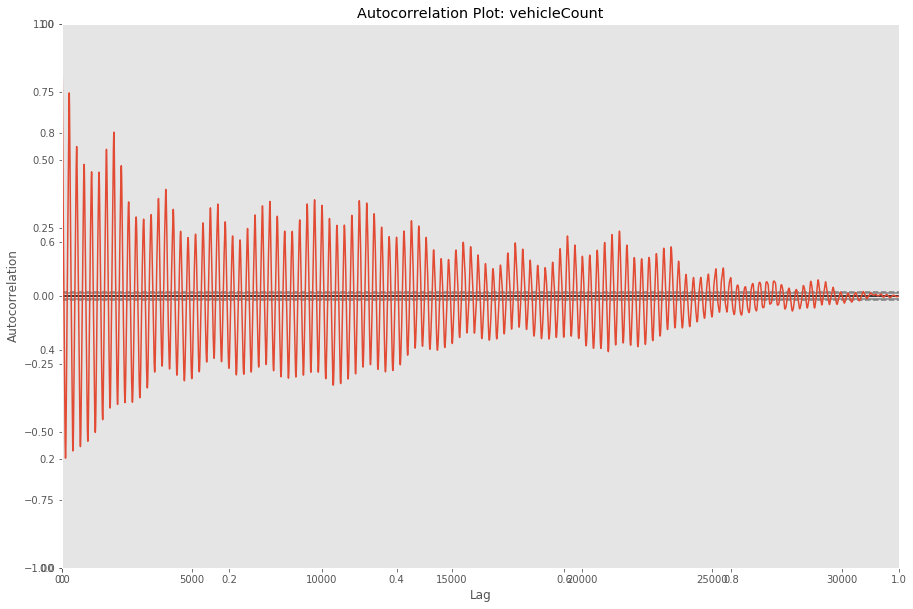


```python
plt.title("Lag Plot: "+label)
pd.plotting.lag_plot(df[label])
plt.show()
```


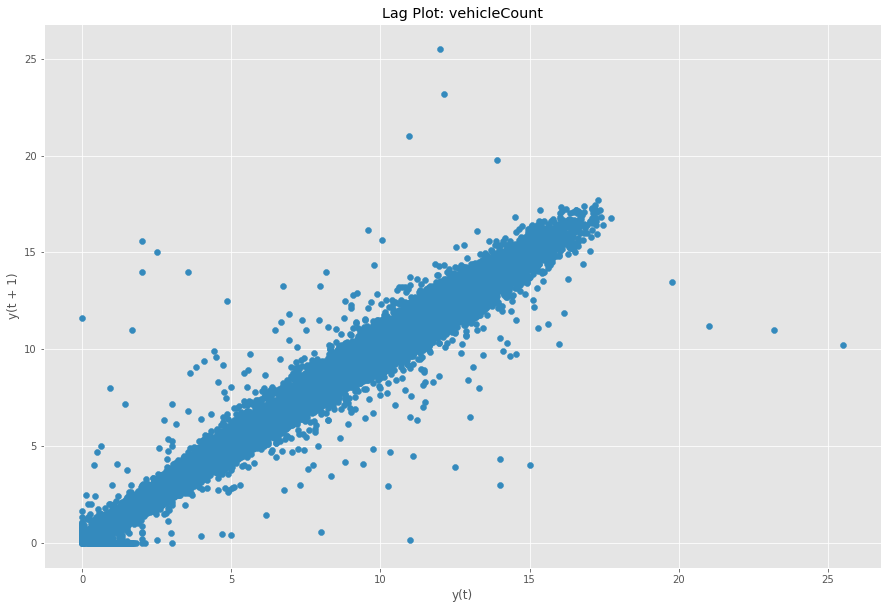


# LSTM prediction


```python
data_ = hourly
mydata=data_.loc[:, [label]]
mydata = mydata.set_index(data_.index)
mydata.head()
mydata.shape
```


    (2745, 1)


```python
#Use MinMaxScaler to normalize 'KWH/hh (per half hour) ' to range from 0 to 1
from sklearn.preprocessing import MinMaxScaler
values = mydata[label].values.reshape(-1,1)
values = values.astype('float32')
scaler = MinMaxScaler(feature_range=(0, 1))
scaled = scaler.fit_transform(values)
```


```python
train_size = int(len(scaled) * 0.8)
test_size = len(scaled) - train_size
train, test = scaled[0:train_size,:], scaled[train_size:len(scaled),:]
print(len(train), len(test))
```

    2196 549


```python
def create_dataset(dataset, look_back=1):
    dataX, dataY = [], []
    for i in range(len(dataset) - look_back):
        a = dataset[i:(i + look_back), 0]
        dataX.append(a)
        dataY.append(dataset[i + look_back, 0])
    print(len(dataY))
    return np.array(dataX), np.array(dataY)
```


```python
look_back = 5
trainX, trainY = create_dataset(train, look_back)
testX, testY = create_dataset(test, look_back)
```

    2191
    544


```python
trainX = np.reshape(trainX, (trainX.shape[0], 1, trainX.shape[1]))
testX = np.reshape(testX, (testX.shape[0], 1, testX.shape[1]))
```


```python
from keras.models import Sequential
from keras.layers import Dense
from keras.layers import LSTM
model = Sequential()
model.add(LSTM(100, input_shape=(trainX.shape[1], trainX.shape[2])))
model.add(Dense(1))
model.compile(loss='mae', optimizer='adam')
history = model.fit(trainX, trainY, epochs=30, batch_size=10, validation_data=(testX, testY), verbose=1, shuffle=False)
```

    /home/enigmaeth/miniconda3/envs/tf/lib/python3.6/site-packages/h5py/__init__.py:36: FutureWarning: Conversion of the second argument of issubdtype from `float` to `np.floating` is deprecated. In future, it will be treated as `np.float64 == np.dtype(float).type`.
      from ._conv import register_converters as _register_converters
    Using TensorFlow backend.


    Train on 2191 samples, validate on 544 samples
    Epoch 1/30
    2191/2191 [==============================] - 14s 6ms/step - loss: 0.1400 - val_loss: 0.0842
    Epoch 2/30
    2191/2191 [==============================] - 2s 748us/step - loss: 0.0838 - val_loss: 0.0622
    Epoch 3/30
    2191/2191 [==============================] - 2s 761us/step - loss: 0.0685 - val_loss: 0.0544
    Epoch 4/30
    2191/2191 [==============================] - 2s 750us/step - loss: 0.0642 - val_loss: 0.0516
    Epoch 5/30
    2191/2191 [==============================] - 2s 893us/step - loss: 0.0614 - val_loss: 0.0501
    Epoch 6/30
    2191/2191 [==============================] - 2s 964us/step - loss: 0.0589 - val_loss: 0.0481
    Epoch 7/30
    2191/2191 [==============================] - 2s 816us/step - loss: 0.0567 - val_loss: 0.0467
    Epoch 8/30
    2191/2191 [==============================] - 2s 918us/step - loss: 0.0548 - val_loss: 0.0457
    Epoch 9/30
    2191/2191 [==============================] - 2s 830us/step - loss: 0.0535 - val_loss: 0.0462
    Epoch 10/30
    2191/2191 [==============================] - 2s 889us/step - loss: 0.0528 - val_loss: 0.0443
    Epoch 11/30
    2191/2191 [==============================] - 2s 732us/step - loss: 0.0524 - val_loss: 0.0440
    Epoch 12/30
    2191/2191 [==============================] - 2s 819us/step - loss: 0.0526 - val_loss: 0.0437
    Epoch 13/30
    2191/2191 [==============================] - 2s 762us/step - loss: 0.0518 - val_loss: 0.0436
    Epoch 14/30
    2191/2191 [==============================] - 2s 902us/step - loss: 0.0511 - val_loss: 0.0429
    Epoch 15/30
    2191/2191 [==============================] - 2s 812us/step - loss: 0.0510 - val_loss: 0.0438
    Epoch 16/30
    2191/2191 [==============================] - 2s 754us/step - loss: 0.0505 - val_loss: 0.0435
    Epoch 17/30
    2191/2191 [==============================] - 2s 745us/step - loss: 0.0499 - val_loss: 0.0417
    Epoch 18/30
    2191/2191 [==============================] - 3s 1ms/step - loss: 0.0495 - val_loss: 0.0425
    Epoch 19/30
    2191/2191 [==============================] - 2s 1ms/step - loss: 0.0485 - val_loss: 0.0414
    Epoch 20/30
    2191/2191 [==============================] - 2s 854us/step - loss: 0.0484 - val_loss: 0.0412
    Epoch 21/30
    2191/2191 [==============================] - 2s 838us/step - loss: 0.0480 - val_loss: 0.0409
    Epoch 22/30
    2191/2191 [==============================] - 2s 823us/step - loss: 0.0473 - val_loss: 0.0409
    Epoch 23/30
    2191/2191 [==============================] - 2s 860us/step - loss: 0.0471 - val_loss: 0.0425
    Epoch 24/30
    2191/2191 [==============================] - 2s 856us/step - loss: 0.0468 - val_loss: 0.0414
    Epoch 25/30
    2191/2191 [==============================] - 2s 797us/step - loss: 0.0465 - val_loss: 0.0411
    Epoch 26/30
    2191/2191 [==============================] - 2s 764us/step - loss: 0.0464 - val_loss: 0.0410
    Epoch 27/30
    2191/2191 [==============================] - 2s 1ms/step - loss: 0.0464 - val_loss: 0.0406
    Epoch 28/30
    2191/2191 [==============================] - 2s 1ms/step - loss: 0.0461 - val_loss: 0.0406
    Epoch 29/30
    2191/2191 [==============================] - 2s 924us/step - loss: 0.0461 - val_loss: 0.0413
    Epoch 30/30
    2191/2191 [==============================] - 2s 828us/step - loss: 0.0460 - val_loss: 0.0409


```python
plt.plot(history.history['loss'], label='train')
plt.plot(history.history['val_loss'], label='test')
plt.legend()
```


    <matplotlib.legend.Legend at 0x7f19484099e8>


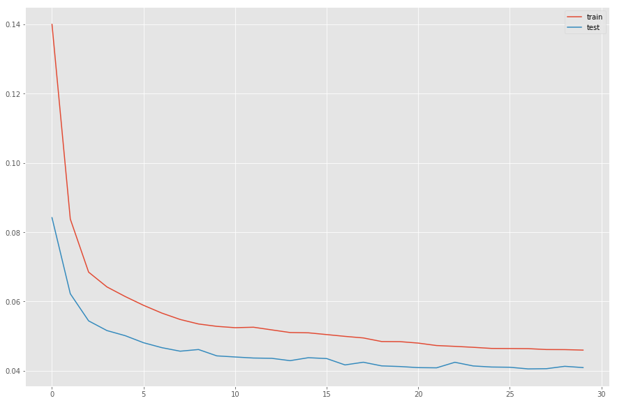


```python
yhat = model.predict(testX)
plt.plot(yhat, label='predict')
plt.plot(testY, label='true')
plt.legend()
```


    <matplotlib.legend.Legend at 0x7f19483aefd0>


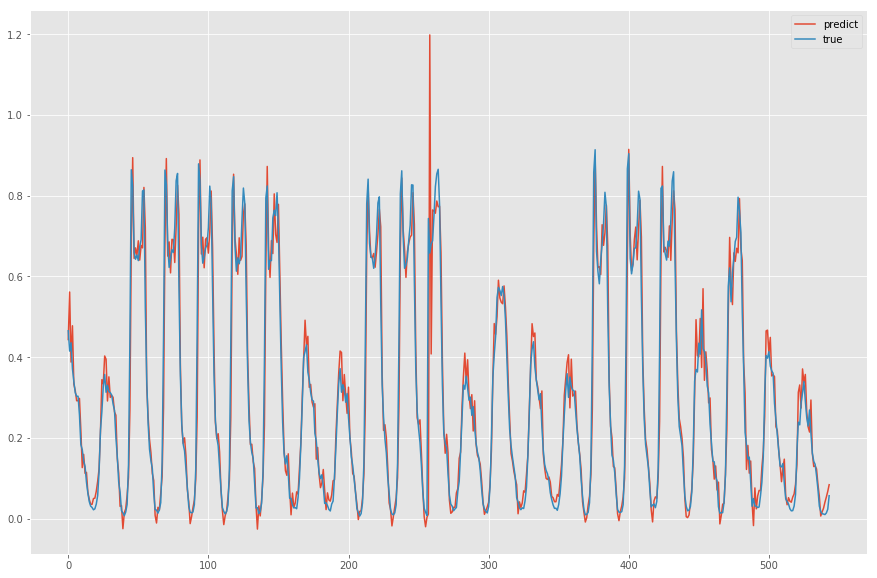


```python
from math import sqrt
from sklearn.metrics import mean_squared_error
yhat_inverse = scaler.inverse_transform(yhat.reshape(-1, 1))
testY_inverse = scaler.inverse_transform(testY.reshape(-1, 1))
rmse = sqrt(mean_squared_error(testY_inverse, yhat_inverse))
print('Test RMSE: %.3f' % rmse)
```

    Test RMSE: 1.078


```python
plt.plot(yhat_inverse, label='predict')
plt.plot(testY_inverse, label='actual', alpha=0.5)
plt.legend()
```


    <matplotlib.legend.Legend at 0x7f19483292b0>


# Clustering


```python
raw_data_df['date']=pd.to_datetime(raw_data_df['date'])
raw_data_df['dy']=raw_data_df['date'].dt.dayofyear
raw_data_df['heure']=raw_data_df['date'].dt.time
data_2014=raw_data_df.loc[:, ['heure','dy',label]]
temp=raw_data_df.loc[:, ['dy',label]]
data_2014[label]=pd.to_numeric(data_2014[label],errors='coerce')
temp=temp.set_index(data_2014.heure)
temp=data_2014.pivot_table(index=['heure'],columns=['dy'] ,values=[label],fill_value=0)

temp.head()
```


<div>
<style scoped>
    .dataframe tbody tr th:only-of-type {
        vertical-align: middle;
    }

    .dataframe tbody tr th {
        vertical-align: top;
    }

    .dataframe thead tr th {
        text-align: left;
    }

    .dataframe thead tr:last-of-type th {
        text-align: right;
    }
</style>
<table border="1" class="dataframe">
  <thead>
    <tr>
      <th></th>
      <th colspan="21" halign="left">vehicleCount</th>
    </tr>
    <tr>
      <th>dy</th>
      <th>44</th>
      <th>45</th>
      <th>46</th>
      <th>47</th>
      <th>48</th>
      <th>49</th>
      <th>50</th>
      <th>51</th>
      <th>52</th>
      <th>53</th>
      <th>...</th>
      <th>151</th>
      <th>152</th>
      <th>153</th>
      <th>154</th>
      <th>155</th>
      <th>156</th>
      <th>157</th>
      <th>158</th>
      <th>159</th>
      <th>160</th>
    </tr>
    <tr>
      <th>heure</th>
      <th></th>
      <th></th>
      <th></th>
      <th></th>
      <th></th>
      <th></th>
      <th></th>
      <th></th>
      <th></th>
      <th></th>
      <th></th>
      <th></th>
      <th></th>
      <th></th>
      <th></th>
      <th></th>
      <th></th>
      <th></th>
      <th></th>
      <th></th>
      <th></th>
    </tr>
  </thead>
  <tbody>
    <tr>
      <th>00:00:00</th>
      <td>0.0</td>
      <td>0.271739</td>
      <td>0.561798</td>
      <td>0.966667</td>
      <td>0.133333</td>
      <td>0.253333</td>
      <td>0.305263</td>
      <td>0.500000</td>
      <td>0.286885</td>
      <td>1.111111</td>
      <td>...</td>
      <td>0.313333</td>
      <td>0.506667</td>
      <td>0.186667</td>
      <td>0.293333</td>
      <td>0.560000</td>
      <td>0.253333</td>
      <td>0.306667</td>
      <td>0.0</td>
      <td>1.333333</td>
      <td>0.256410</td>
    </tr>
    <tr>
      <th>00:05:00</th>
      <td>0.0</td>
      <td>0.228261</td>
      <td>0.586957</td>
      <td>0.820000</td>
      <td>0.153333</td>
      <td>0.186667</td>
      <td>0.373737</td>
      <td>0.370787</td>
      <td>0.229167</td>
      <td>0.972973</td>
      <td>...</td>
      <td>0.386667</td>
      <td>0.346667</td>
      <td>0.193333</td>
      <td>0.160000</td>
      <td>0.876712</td>
      <td>0.285714</td>
      <td>0.246667</td>
      <td>0.0</td>
      <td>0.000000</td>
      <td>0.308725</td>
    </tr>
    <tr>
      <th>00:10:00</th>
      <td>0.0</td>
      <td>0.193548</td>
      <td>0.756757</td>
      <td>0.000000</td>
      <td>0.173333</td>
      <td>0.166667</td>
      <td>0.370787</td>
      <td>0.361702</td>
      <td>0.309278</td>
      <td>0.853933</td>
      <td>...</td>
      <td>0.480000</td>
      <td>0.446667</td>
      <td>0.160000</td>
      <td>0.160000</td>
      <td>0.806667</td>
      <td>0.000000</td>
      <td>0.000000</td>
      <td>0.0</td>
      <td>0.666667</td>
      <td>0.220000</td>
    </tr>
    <tr>
      <th>00:15:00</th>
      <td>0.0</td>
      <td>0.202247</td>
      <td>1.088235</td>
      <td>0.926667</td>
      <td>0.113333</td>
      <td>0.246667</td>
      <td>0.506173</td>
      <td>0.369565</td>
      <td>0.363636</td>
      <td>0.905405</td>
      <td>...</td>
      <td>0.460000</td>
      <td>0.580000</td>
      <td>0.100000</td>
      <td>0.326667</td>
      <td>0.793333</td>
      <td>0.453333</td>
      <td>0.000000</td>
      <td>1.0</td>
      <td>0.933333</td>
      <td>0.193333</td>
    </tr>
    <tr>
      <th>00:20:00</th>
      <td>0.0</td>
      <td>0.397590</td>
      <td>0.827273</td>
      <td>0.646667</td>
      <td>0.086667</td>
      <td>0.160000</td>
      <td>0.427083</td>
      <td>0.245763</td>
      <td>0.274725</td>
      <td>0.746479</td>
      <td>...</td>
      <td>0.433333</td>
      <td>0.626667</td>
      <td>0.133333</td>
      <td>0.380000</td>
      <td>0.820000</td>
      <td>0.333333</td>
      <td>0.000000</td>
      <td>0.0</td>
      <td>0.573333</td>
      <td>0.256410</td>
    </tr>
  </tbody>
</table>
<p>5 rows × 117 columns</p>
</div>


```python
temp.plot(figsize=(15, 35))
```


    <matplotlib.axes._subplots.AxesSubplot at 0x7f1948364da0>


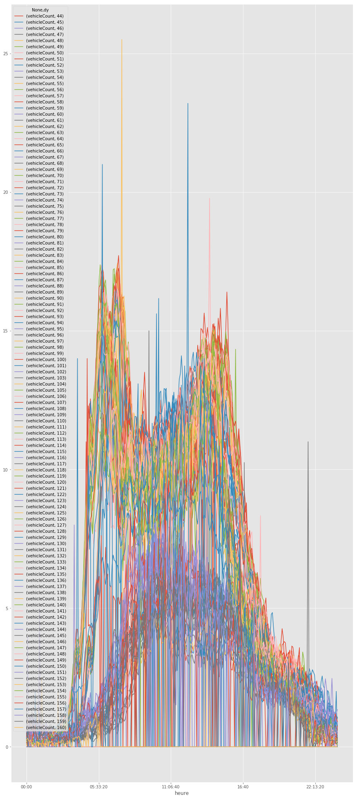


```python
temp.iloc[:,0].plot(x=temp.index.get_level_values)
temp.iloc[:,1].plot(x=temp.index.get_level_values)
temp.iloc[:,2].plot(x=temp.index.get_level_values)
```


    <matplotlib.axes._subplots.AxesSubplot at 0x7f18bb6d4e48>


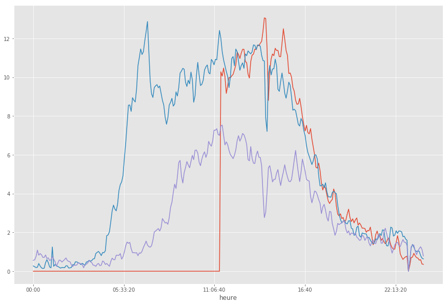


```python
plt.figure(figsize=(11,10))
colors = ['#D62728','#2C9F2C','#FD7F23','#1F77B4','#9467BD',
          '#8C564A','#7F7F7F','#1FBECF','#E377C2','#BCBD27',
          '#CD5C5C',"#FFB500"]

for i, r in enumerate([0,1,2,3,4,5,6,7,8,9,10],1):
     
    plt.subplot(4,4,i)
    plt.plot(temp.iloc[:,r],  color=colors[i], linewidth=2)
    plt.xlabel('Heurestics')
    plt.legend(loc='upper right')
    plt.tight_layout()
```


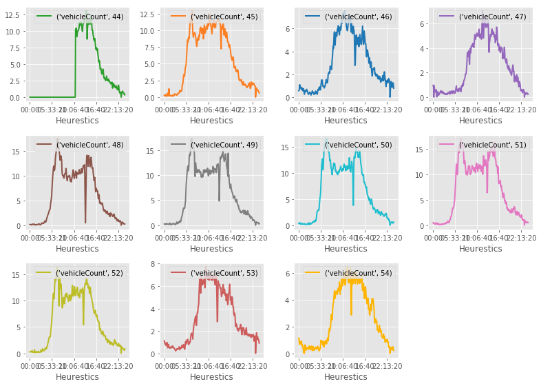


```python
from scipy.cluster.hierarchy import dendrogram, linkage
Z = linkage(temp.iloc[:,0:365], 'ward')
```


```python
plt.figure(figsize=(25, 10))
plt.title('Hierarchical Clustering Dendrogram')
plt.xlabel('sample index')
plt.ylabel('distance')
dendrogram(
    Z,
    leaf_rotation=90.,  # rotates the x axis labels
    leaf_font_size=8.,  # font size for the x axis labels
)
plt.show()
```


```python
plt.title('Hierarchical Clustering Dendrogram (truncated)')
plt.xlabel('sample index')
plt.ylabel('distance')
dendrogram(
    Z,
    truncate_mode='lastp',  # show only the last p merged clusters
    p=12,  # show only the last p merged clusters
    show_leaf_counts=False,  # otherwise numbers in brackets are counts
    leaf_rotation=90.,
    leaf_font_size=12.,
    show_contracted=True,  # to get a distribution impression in truncated branches
)
plt.show()
```


